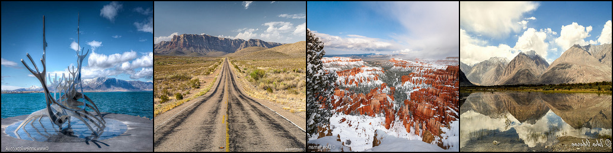
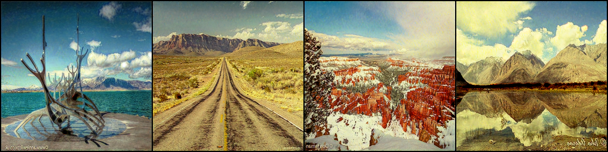
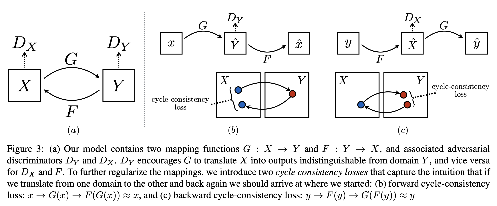
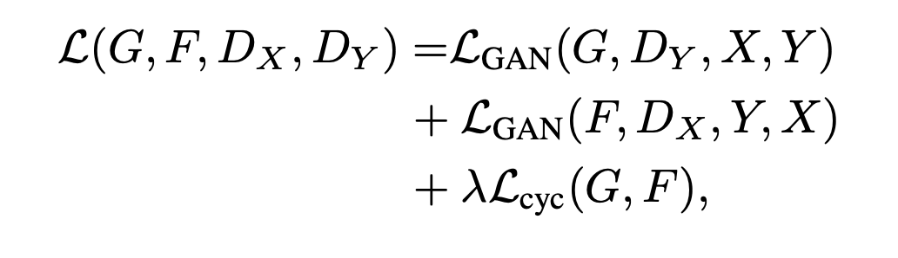
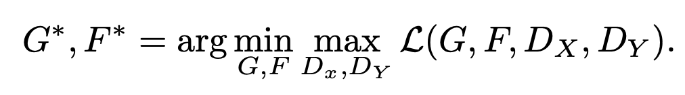

# StyleTransfer

### Overview

This repository contains my submission for the Dashtoon Fresher Hiring Assignment for the Generative AI Stream. The task was to "to create a deep learning model capable of adapting an existing work to resemble the aesthetic of any art. The model should be able to analyze the artistic style of the selected art and apply similar stylistic features to a new, original artwork, creating a piece that seems as though it could have been created by the artist themselves."
I classified this problem as that of image-to-image translation where the goal is to learn the mapping between an input image and an output image using a training set of aligned image pairs.
However, for many tasks, paired training data will not be available. The authors present an approach for learning to translate an image from a source domain X to a target domain Y in the absence of paired examples. The goal is to learn a mapping G:X→Y such that the distribution of images from G(X) is indistinguishable from the distribution Y using an adversarial loss. Because this mapping is highly under-constrained, it has to be coupled with an inverse mapping F:Y→X and introduce a cycle consistency loss to push F(G(X))≈X (and vice versa). 

### Table of Contents

- [Results](#results)
- [Setup](#setup)
- [Model Architecture](#model-architecture)
- [Objective](#objective)
- [Dataset](#dataset)
- [Training](#training)
- [Evaluation](#evaluation)
- [Additional experiments](#additional-experiments)

### Results

Here are some of the results obtained

<figure>
    
    <figcaption>Figure 1: Real photos</figcaption>
</figure>


<figure>
    
    <figcaption>Figure 2: Fake Vangogh</figcaption>
</figure>

### Setup

1. Clone the repository and cd into the repository
    ```
    git clone https://github.com/Mrunmay-0615/StyleTransfer
    
    cd StyleTransfer
    ```
2. Create a Virtual Environment using conda
   ```
   conda create --n your_environment_name python=3.10
   conda activate your_environment_name
   ```
3. Install the required packages
   ```
   pip install -r requirements.txt
   ```
4. Use the notebook after starting the jupyter server
   ```
   jupyter notebook
   ```

 I have uploaded my trained models to the Google Drive [here](https://drive.google.com/drive/folders/1R-2Urv8Ev6cNQklT72CGytn6lX2Q0HyA?usp=sharing)


### Model Architecture

I decided to use CycleGAN [(Zhu et. al, 2017)](https://arxiv.org/pdf/1703.10593) for this task which is a novel method for unpaired image-to-image translation. One of the main reasons for choosing this method is that the algorithm doesn't require paired images.
Now, my goal is to learn to convert photographs to look as though painted by some artist and imitate their artistic style. Let's say X is the set of photographs in consideration and
Y is the set of images pertaining to the artist's style ( I have chosen Vangogh here). Then the aim is to learn a mapping G: X → Y such that the distribution of images from G(X) is indistinguishable from the distribution Y using an adversarial loss.
Because this mapping is highly under-constrained, we couple it with an inverse mapping F : Y → X and introduce a cycle consistency loss to enforce F(G(X)) ≈ X (and vice versa).



* For the Generator, the authors used a ResNet-based architecture, but I used the standard UNet architecture because it helps to capture fine details.
* For the discriminator, I am following the architecture used by the authors.

### Objective

The total objective of the algorithm is as follows:

 

where the GAN components represent the adversarial losses for the respective generators and there is an additional cycle consistency loss.
Now, the objective is to find the optimal paramteters for generators for both the generators by backpropagation.

 

### Dataset

* The dataset can be found [here](http://efrosgans.eecs.berkeley.edu/cyclegan/datasets/vangogh2photo.zip).
* It contains roughly 6000 images each for both domains in the training set, and roughly 2000 images each in the test set.

### Training

I chose the following set of hyperparameters for training.
* Learning rate - 0.001
* Batch size - 4
* Lambda_identity - 5 (The relative weight of identity loss in the total loss)
* Lambda_cycle - 10 (The relative weight of the cycle-consistency loss in the total loss)
* Epochs - 50

### Evaluation

To evaluate content preservation, I am using the Structural Similiarity Index (SSIM score) which assesses the visual quality of an image by comparing its structural information, luminance, and contrast to a reference image. 
I have borrowed the implementation for SSIM score from [here](https://github.com/VainF/pytorch-msssim/blob/master/pytorch_msssim)

To evaluate style transfer, I will use the discriminator's accuracy. If the style transfer is very good, the accuracy should be close to 50% as 
the discriminator will find it difficult to classify whether the image is synthetic or an actual Vangogh artwork.

I evaluated the model on a test set of around 2000 images.

SSIM score: 0.822 (For content preservation)
Discriminator accuracy: 65.31%

I feel the content preservation is quite good which is apparent from the few results I shared above. However, the style transfer is decent and not that good.
The discriminator is decently enough in identifying the fake vangogh and the real photos distinguishably. There is a lot of room for improvement


### Additional Experiments

Apart from the method mentioned above, I also tried solving the problem using the Neural Style Transfer proposed in [Gatys et. al, 2015](https://arxiv.org/abs/1508.06576)
The drawback I saw with this approach was that for every pair of content and style image, you need to run the code separately. The style transfer won't be in real
time. 

I have still included some of the results obtained. They are in the directory ```Gatys```. The ```generated``` sub-directory contains all the generated
images with content infused with style.
